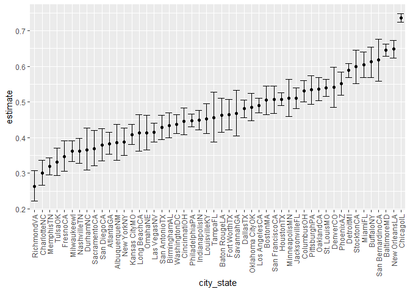
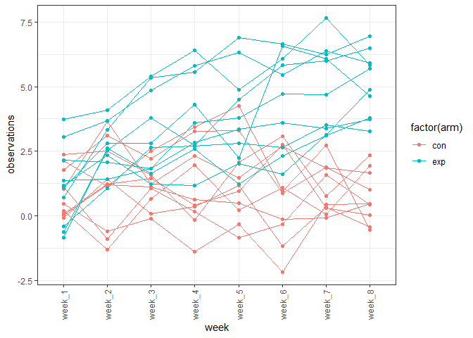

p8105\_hw5\_zh2493
================

## problem 1

data on homicides

``` r
homicide_df = 
  read_csv("./data/homicide-data.csv", na = c(" ", "Unknown")) %>% 
  mutate(city_state = str_c(city, state)) %>% 
  mutate(resolution = case_when(
    disposition == "Closed without arrest" ~ "unsolved",
    disposition == "Closed by arrest" ~ "solved",
    disposition == "Open/No arrest" ~ "unsolved"
  )) %>% 
  filter(city_state != "TulsaAL") %>% 
  select(city_state, everything())
```

    ## Rows: 52179 Columns: 12

    ## -- Column specification --------------------------------------------------------
    ## Delimiter: ","
    ## chr (8): uid, victim_last, victim_first, victim_race, victim_sex, city, stat...
    ## dbl (4): reported_date, victim_age, lat, lon

    ## 
    ## i Use `spec()` to retrieve the full column specification for this data.
    ## i Specify the column types or set `show_col_types = FALSE` to quiet this message.

``` r
# total and unsolved
homicide_df %>% 
  group_by(city_state) %>% 
  summarize(n = n(), unsolved = sum(resolution == "unsolved")) 
```

    ## # A tibble: 50 x 3
    ##    city_state        n unsolved
    ##    <chr>         <int>    <int>
    ##  1 AlbuquerqueNM   378      146
    ##  2 AtlantaGA       973      373
    ##  3 BaltimoreMD    2827     1825
    ##  4 Baton RougeLA   424      196
    ##  5 BirminghamAL    800      347
    ##  6 BostonMA        614      310
    ##  7 BuffaloNY       521      319
    ##  8 CharlotteNC     687      206
    ##  9 ChicagoIL      5535     4073
    ## 10 CincinnatiOH    694      309
    ## # ... with 40 more rows

``` r
baltimore_df = 
  homicide_df %>% 
  filter(city_state == "BaltimoreMD")

baltimore_summary = 
baltimore_df %>% 
  summarize(n = n(), unsolved = sum(resolution == "unsolved"))  
  
# prop.test function
baltimore_test = 
  prop.test(
  x = baltimore_summary %>% pull(unsolved),
  n = baltimore_summary %>% pull(n))

baltimore_test %>% 
  broom::tidy()
```

    ## # A tibble: 1 x 8
    ##   estimate statistic  p.value parameter conf.low conf.high method    alternative
    ##      <dbl>     <dbl>    <dbl>     <int>    <dbl>     <dbl> <chr>     <chr>      
    ## 1    0.646      239. 6.46e-54         1    0.628     0.663 1-sample~ two.sided

let’s try to iterate across cities

``` r
prop_test_function = function(city_df){
  
  city_summary = 
    city_df %>% 
      summarize(n = n(), unsolved = sum(resolution == "unsolved"))  
    
  # prop.test function
  city_test = 
    prop.test(
    x = city_summary %>% pull(unsolved),
    n = city_summary %>% pull(n))
  
  return(city_test)
}


homicide_df %>% 
  filter(city_state == "LouisvilleKY") %>% 
  prop_test_function()
```

    ## 
    ##  1-sample proportions test with continuity correction
    ## 
    ## data:  city_summary %>% pull(unsolved) out of city_summary %>% pull(n), null probability 0.5
    ## X-squared = 4.8767, df = 1, p-value = 0.02722
    ## alternative hypothesis: true p is not equal to 0.5
    ## 95 percent confidence interval:
    ##  0.4120609 0.4948235
    ## sample estimates:
    ##        p 
    ## 0.453125

let’s iterate across all cities.

``` r
results_df =
  homicide_df %>% 
  nest(data = uid:resolution) %>% 
  mutate(
    test_results = map(data,  prop_test_function),
    tidy_results = map(test_results, broom::tidy)) %>% 
  select(city_state, tidy_results) %>% 
  unnest(tidy_results) %>% 
  select(city_state, estimate, starts_with("conf"))
```

error\_bar

``` r
results_df %>% 
  mutate(city_state = fct_reorder(city_state, estimate)) %>% 
  ggplot(aes(x = city_state, y = estimate)) +
  geom_point() +
  geom_errorbar(aes(ymin = conf.low, ymax = conf.high)) +
  theme(axis.text.x = element_text(angle = 90, vjust = 0.5, hjust = 1))
```

<!-- -->

``` r
homicide_df %>% 
  group_by(city_state) %>% 
  summarize(
    unsolved = sum(resolution == "unsolved"),
    n = n()
  ) %>% 
  mutate(
    test_results = map2(unsolved, n, prop.test),
         tidy_results = map(test_results, broom::tidy)) %>% 
  select(city_state , tidy_results) %>% 
  unnest(tidy_results) %>% 
  select(city_state, estimate, starts_with("conf"))
```

    ## # A tibble: 50 x 4
    ##    city_state    estimate conf.low conf.high
    ##    <chr>            <dbl>    <dbl>     <dbl>
    ##  1 AlbuquerqueNM    0.386    0.337     0.438
    ##  2 AtlantaGA        0.383    0.353     0.415
    ##  3 BaltimoreMD      0.646    0.628     0.663
    ##  4 Baton RougeLA    0.462    0.414     0.511
    ##  5 BirminghamAL     0.434    0.399     0.469
    ##  6 BostonMA         0.505    0.465     0.545
    ##  7 BuffaloNY        0.612    0.569     0.654
    ##  8 CharlotteNC      0.300    0.266     0.336
    ##  9 ChicagoIL        0.736    0.724     0.747
    ## 10 CincinnatiOH     0.445    0.408     0.483
    ## # ... with 40 more rows

## Problem2

let’s try to iterate across file names

``` r
library(tidyr)
data_path = "./data/data"

filename1 = 
  list.files(data_path) 


study_df = 
  tibble(filename1) %>% 
  mutate(
    map_df(filename1, ~ read_csv(file.path(data_path, .)))) %>% 
  janitor::clean_names() %>% 
  separate(filename1, into = c("filename", "c"), sep = "\\.") %>% 
  select(-c)

study_df$arm = 
  ifelse(substr(study_df$filename, 1 , 3) == 'con', 'con', 'exp')

head(study_df) %>% knitr::kable()
```

| filename | week\_1 | week\_2 | week\_3 | week\_4 | week\_5 | week\_6 | week\_7 | week\_8 | arm |
|:---------|--------:|--------:|--------:|--------:|--------:|--------:|--------:|--------:|:----|
| con\_01  |    0.20 |   -1.31 |    0.66 |    1.96 |    0.23 |    1.09 |    0.05 |    1.94 | con |
| con\_02  |    1.13 |   -0.88 |    1.07 |    0.17 |   -0.83 |   -0.31 |    1.58 |    0.44 | con |
| con\_03  |    1.77 |    3.11 |    2.22 |    3.26 |    3.31 |    0.89 |    1.88 |    1.01 | con |
| con\_04  |    1.04 |    3.66 |    1.22 |    2.33 |    1.47 |    2.70 |    1.87 |    1.66 | con |
| con\_05  |    0.47 |   -0.58 |   -0.09 |   -1.37 |   -0.32 |   -2.17 |    0.45 |    0.48 | con |
| con\_06  |    2.37 |    2.50 |    1.59 |   -0.16 |    2.08 |    3.07 |    0.78 |    2.35 | con |

``` r
study_df %>% 
  pivot_longer(
    cols = starts_with("week"), 
    names_to = "week", 
    values_to = "observations"
    ) %>% 
  ggplot(aes(x = week, y = observations, group = filename, color = factor(arm))) +
  labs(list(title = " observations on each subject over time", y = "observations", x = "week")) + 
  geom_line() +
  geom_point() +
  theme_bw() +
  theme(axis.text.x = element_text(angle = 90, vjust = 0.5, hjust = 1))
```

<!-- --> \*
the experiment group is increasing and the control group stay the same.

## Problem3

library(tidyverse)

``` r
library(tidyverse)

set.seed(10)

iris_with_missing = iris %>% 
  map_df(~replace(.x, sample(1:150, 20), NA)) %>%
  mutate(Species = as.character(Species))
```

``` r
fill_in_function = function(x){
  
  if(is.numeric(x)){
    
    replace(x, is.na(x), mean(x, na.rm = TRUE))
    
  }
  else if(is.character(x)){
    
    replace(x, is.na(x), "virginica")
    
  }
}

iris = map_df(iris_with_missing, fill_in_function)

head(iris) %>% knitr::kable()
```

| Sepal.Length | Sepal.Width | Petal.Length | Petal.Width | Species |
|-------------:|------------:|-------------:|------------:|:--------|
|          5.1 |         3.5 |          1.4 |    0.200000 | setosa  |
|          4.9 |         3.0 |          1.4 |    0.200000 | setosa  |
|          4.7 |         3.2 |          1.3 |    0.200000 | setosa  |
|          4.6 |         3.1 |          1.5 |    1.192308 | setosa  |
|          5.0 |         3.6 |          1.4 |    0.200000 | setosa  |
|          5.4 |         3.9 |          1.7 |    0.400000 | setosa  |
